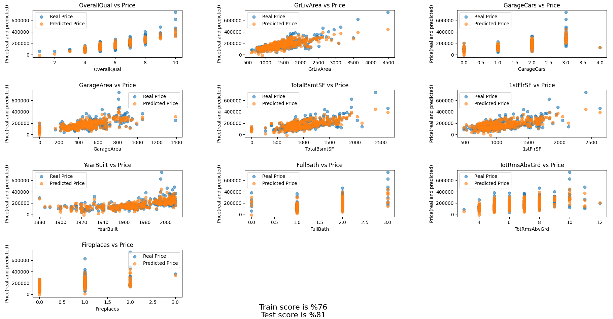

# 🏡 Housing Price Prediction with Linear Regression

This project is a simple implementation of a **Linear Regression** model using **scikit-learn** to predict housing prices based on various property features. It utilizes a subset of the Ames Housing Dataset.

## 📊 Overview

The model is trained to predict house sale prices based on the following 10 features:

- `OverallQual` – Overall material and finish quality  
- `GrLivArea` – Above grade (ground) living area square feet  
- `GarageCars` – Size of garage in car capacity  
- `GarageArea` – Size of garage in square feet  
- `TotalBsmtSF` – Total square feet of basement area  
- `1stFlrSF` – First Floor square feet  
- `YearBuilt` – Original construction date  
- `FullBath` – Full bathrooms above grade  
- `TotRmsAbvGrd` – Total rooms above grade (excluding bathrooms)  
- `Fireplaces` – Number of fireplaces  

## 🛠️ Tools & Libraries

- Python 🐍  
- Pandas  
- scikit-learn  
- Matplotlib  

## 📁 Dataset

The dataset used is `train.csv` from the [Kaggle: House Prices - Advanced Regression Techniques](https://www.kaggle.com/competitions/house-prices-advanced-regression-techniques) competition.

Make sure to place `train.csv` in the root directory before running the code.

## 🚀 How to Run

1. Clone the repository:
   ```bash
   git clone https://github.com/mertpy/house-price-prediction.git
   cd house-price-prediction
   ```

2. Install dependencies:
   ```bash
   pip install pandas scikit-learn matplotlib
   ```

3. Run the script:
   ```bash
   python main.py
   ```

## 📈 Model Performance

The script splits the dataset into training and testing sets (77% training, 23% testing), fits a linear regression model, and visualizes the predicted vs real prices for each feature.

At the bottom of the plot, you can see the training and testing scores to evaluate the model performance.

## 📷 Sample Output

The script generates a multi-subplot chart comparing predicted vs actual prices for each feature.  
Here's a sample view:


